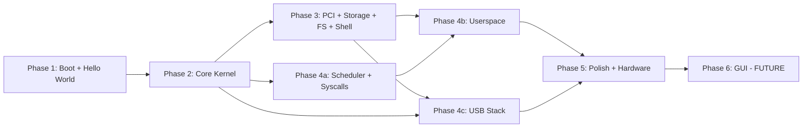

# NexusOS — Complete Architecture Specification

> **Document purpose**: This specification is designed to be consumed by an implementation agent. Each section contains actionable details, exact file paths, required compiler flags, data structure layouts, and dependency ordering. The coordinator (Senior Systems Architect) does NOT write code — this document directs the agent who does.

---

## 1. System Overview

| Property | Value |
|---|---|
| **OS Name** | NexusOS |
| **Architecture** | x86-64 (Long Mode) |
| **Kernel Type** | Monolithic, with managed services running as individual kernel-space processes |
| **Boot Protocol** | Limine v11.x (dual BIOS + UEFI) |
| **Boot Media** | ISO (CD) and HDD/USB raw image |
| **Languages** | C (kernel, drivers, services), NASM x86-64 assembly (entry, ISRs, context switch) |
| **Build System** | GNU Make, built on WSL2 or Linux |
| **Test Targets** | QEMU (`qemu-system-x86_64`), VirtualBox, physical x64 hardware |

### 1.1 Kernel Architecture

The kernel is **monolithic** — all kernel code runs in ring 0, sharing a single address space. However, kernel-managed subsystems (memory manager, scheduler, device manager, filesystem) are logically organized as **service processes** within the kernel:

```
┌─────────────────────────────────────────────────────────────┐
│                      USERSPACE (Ring 3)                      │
│   [ init ]  [ shell ]  [ user programs ]                     │
├─────────────── System Call Interface (syscall/sysret) ───────┤
│                    KERNEL SPACE (Ring 0)                      │
│                                                              │
│  ┌───────────────── DISPLAY STACK ─────────────────────┐     │
│  │  ┌──────────────────────────────────────────────┐   │     │
│  │  │  Terminal Console (active by default)         │   │     │
│  │  │  VT100 emulation, scrollback, line editing    │   │     │
│  │  └──────────────────────────────────────────────┘   │     │
│  │  ┌──────────────────────────────────────────────┐   │     │
│  │  │  Framebuffer Driver (from Limine)             │   │     │
│  │  └──────────────────────────────────────────────┘   │     │
│  └─────────────────────────────────────────────────────┘     │
│                                                              │
│  ┌──────────┐ ┌──────────┐ ┌──────────┐ ┌───────────────┐   │
│  │ Memory   │ │Scheduler │ │  Device  │ │  Filesystem   │   │
│  │ Manager  │ │ Service  │ │ Manager  │ │   Service     │   │
│  │ Service  │ │          │ │ Service  │ │ VFS + ramfs + │   │
│  │          │ │          │ │          │ │ FAT32 + NTFS  │   │
│  │          │ │          │ │          │ │ + ext2/ext4   │   │
│  └──────────┘ └──────────┘ └──────────┘ └───────────────┘   │
│  ┌──────────────────────────────────────────────────────┐    │
│  │              DRIVER SUBSYSTEM                         │    │
│  │  ┌─────────┐ ┌──────────┐ ┌──────────┐ ┌─────────┐  │    │
│  │  │ PS/2 KB │ │ PS/2     │ │ USB xHCI │ │ ATA/    │  │    │
│  │  │ Driver  │ │ Mouse    │ │ + HID    │ │ AHCI    │  │    │
│  │  └─────────┘ └──────────┘ └──────────┘ └─────────┘  │    │
│  │  ┌─────────┐ ┌──────────┐                            │    │
│  │  │  PCI    │ │  Timer   │                            │    │
│  │  │ Driver  │ │  (PIT)   │                            │    │
│  │  └─────────┘ └──────────┘                            │    │
│  └──────────────────────────────────────────────────────┘    │
│  ┌──────────────────────────────────────────────────────┐    │
│  │              HARDWARE ABSTRACTION LAYER               │    │
│  │  GDT │ IDT │ PIC/APIC │ Paging │ I/O Ports           │    │
│  └──────────────────────────────────────────────────────┘    │
└─────────────────────────────────────────────────────────────┘
```

### 1.4 Display Stack — Userspace Desktop Environments

The display system is designed to completely decouple the graphical interface from the kernel. The kernel solely provides the hardware primitives.

```
┌────────────────────────────────────────────────────────┐
│ USERSPACE (Ring 3)                                     │
│  ┌──────────────────┐    ┌──────────────────────────┐  │
│  │ Desktop Env A    │    │ Desktop Env B            │  │
│  │ (e.g. Wayland-   │ OR │ (Custom / X11-like)      │  │
│  │  like server)    │    │                          │  │
│  └────────┬─────────┘    └─────────────┬────────────┘  │
│           │                            │               │
├───────────┼────────────────────────────┼───────────────┤
│ KERNEL    │      System Calls (mmap, read, ioctl)      │
│           ▼                            ▼               │
│  ┌──────────────────┐    ┌──────────────────────────┐  │
│  │ /dev/fb0         │    │ /dev/input/*             │  │
│  │ (Framebuffer)    │    │ (Mouse / KB Events)      │  │
│  └──────────────────┘    └──────────────────────────┘  │
└────────────────────────────────────────────────────────┘
```

- **Boot**: The kernel initializes a terminal console (VT100) running directly on the framebuffer.
- **Kernel Independence**: Any future GUI or Desktop Environment (Phase 6) operates strictly in **userspace**.
- **Kernel API for GUI**:
  - The Display Manager exposes `/dev/fb0`. A userspace display server uses `SYS_MMAP` to map display memory into its address space.
  - The Input Manager exposes `/dev/input/eventX`. The display server reads unified events (`INPUT_EVENT_MOUSE_MOVE`, etc.) via `SYS_READ`.
  - Taking control of the display (via `SYS_IOCTL` on `/dev/fb0`) automatically pauses the kernel terminal console.
- **Interchangeability**: Multiple Desktop Environments, built by varying agents, can run on top of the same kernel without requiring *any* kernel recompilation or modifications.

### 1.5 Filesystem Architecture

The OS uses a **unified VFS** with an **in-memory root filesystem (ramfs)** and support for popular on-disk formats:

```
/                      ← ramfs (in-memory, always mounted as root)
├── dev/               ← device nodes
├── tmp/               ← temporary files (ramfs)
├── proc/              ← process info (procfs, future)
├── mnt/
│   ├── hda1/          ← auto-mounted NTFS partition
│   ├── hda2/          ← auto-mounted ext4 partition
│   └── sda1/          ← USB drive (FAT32)
└── boot/              ← boot files
```

| Filesystem | Type | Read | Write | Phase |
|---|---|---|---|---|
| **ramfs** | In-memory | ✅ | ✅ | 3 |
| **FAT32** | On-disk | ✅ | ✅ | 3 |
| **NTFS** | On-disk | ✅ | Read-only initially | 3 |
| **ext2/ext4** | On-disk | ✅ | Read-only initially | 3 |
| **devfs** | Virtual | ✅ | — | 4 |
| **procfs** | Virtual | ✅ | — | Future |

### 1.2 Driver Model

Each hardware device gets its own **individual driver** module with a standardized interface:

```c
// Every driver must implement this interface
typedef struct driver {
    const char *name;           // e.g., "ps2_keyboard"
    uint32_t   type;            // DRIVER_TYPE_INPUT, DRIVER_TYPE_STORAGE, etc.
    int  (*init)(void);         // Return 0 on success
    void (*deinit)(void);
    int  (*probe)(uint16_t vendor_id, uint16_t device_id);  // PnP probe
    void (*irq_handler)(void);  // Registered with IDT
} driver_t;
```

**Plug-and-Play (PnP)** is implemented via:
1. PCI bus scan → for each device, iterate registered drivers → call `probe()`
2. USB enumeration (xHCI) → for each USB descriptor, match HID class → load appropriate driver
3. PS/2 presence detection via controller commands

### 1.3 Input Stack (PS/2 + USB)

```
┌─────────────────────────────────────┐
│         Input Event Queue            │
│  (unified keyboard/mouse events)     │
├──────────┬──────────┬───────────────┤
│ PS/2 KB  │ PS/2     │  USB HID      │
│ Driver   │ Mouse    │  Driver       │
│ (IRQ1)   │ (IRQ12)  │  (xHCI IRQ)   │
├──────────┴──────────┴───────────────┤
│  i8042 Controller    │  xHCI Host   │
│  (I/O 0x60, 0x64)    │  Controller  │
└──────────────────────┴──────────────┘
```

### 1.6 Shell — Linux-Like Command Interface

The kernel-mode shell (Phase 2) and later userspace shell (Phase 4) implement these essential commands:

| Command | Syntax | Description |
|---|---|---|
| `ls` | `ls [path]` | List directory contents (with `-l`, `-a` flags) |
| `cd` | `cd <path>` | Change working directory |
| `pwd` | `pwd` | Print working directory |
| `cat` | `cat <file>` | Print file contents |
| `echo` | `echo <text>` | Print text (supports `>` redirect to file) |
| `mkdir` | `mkdir <dir>` | Create directory |
| `rmdir` | `rmdir <dir>` | Remove empty directory |
| `rm` | `rm <file>` | Remove file |
| `cp` | `cp <src> <dst>` | Copy file |
| `mv` | `mv <src> <dst>` | Move / rename file |
| `touch` | `touch <file>` | Create empty file |
| `clear` | `clear` | Clear terminal screen |
| `mount` | `mount <dev> <path>` | Mount filesystem |
| `umount` | `umount <path>` | Unmount filesystem |
| `df` | `df` | Show mounted filesystems and usage |
| `free` | `free` | Show memory usage |
| `ps` | `ps` | List running processes |
| `kill` | `kill <pid>` | Terminate a process |
| `help` | `help` | List available commands |
| `shutdown` | `shutdown` | ACPI power off |
| `reboot` | `reboot` | ACPI reboot |

---

## 2. Directory Structure

> [!IMPORTANT]
> All paths below are relative to the repository root: `COMPLETE_OS_DEVELOPMENT/`

```
COMPLETE_OS_DEVELOPMENT/
│
├── GNUmakefile                      # Top-level: ISO/HDD build, QEMU targets
├── limine.conf                      # Limine bootloader config
├── README.md
│
├── kernel/
│   ├── GNUmakefile                  # Kernel build: compile, link
│   ├── get-deps                     # Script to fetch limine headers, freestanding C headers
│   │
│   ├── linker-scripts/
│   │   └── x86_64.lds              # Kernel linker script (higher-half at 0xFFFFFFFF80000000)
│   │
│   ├── src/
│   │   ├── kernel.c                 # C entry: kmain(), init sequence
│   │   │
│   │   ├── boot/
│   │   │   └── limine_requests.c    # All Limine request structs (framebuffer, memmap, RSDP, HHDM)
│   │   │
│   │   ├── hal/                     # Hardware Abstraction Layer
│   │   │   ├── gdt.h / gdt.c       # 64-bit GDT + TSS
│   │   │   ├── idt.h / idt.c       # IDT setup
│   │   │   ├── isr.h               # ISR declarations
│   │   │   ├── pic.h / pic.c       # 8259 PIC remapping
│   │   │   ├── apic.h / apic.c     # Local APIC + IO APIC (Phase 5)
│   │   │   └── io.h                # inb/outb/inw/outw inline asm
│   │   │
│   │   ├── arch/
│   │   │   └── x86_64/
│   │   │       ├── isr_stubs.asm   # ISR/IRQ assembly stubs (push regs, call C handler, iretq)
│   │   │       ├── gdt_flush.asm   # lgdt + segment reload
│   │   │       └── context.asm     # Context switch (save/restore registers)
│   │   │
│   │   ├── mm/                      # Memory Management Service
│   │   │   ├── pmm.h / pmm.c       # Physical Memory Manager (bitmap allocator)
│   │   │   ├── vmm.h / vmm.c       # Virtual Memory Manager (4-level paging)
│   │   │   └── heap.h / heap.c     # Kernel heap (kmalloc / kfree)
│   │   │
│   │   ├── sched/                   # Scheduler Service
│   │   │   ├── process.h / process.c
│   │   │   ├── thread.h / thread.c
│   │   │   └── scheduler.h / scheduler.c  # Round-robin, priority later
│   │   │
│   │   ├── display/                 # Display Stack
│   │   │   ├── display_manager.h / display_manager.c  # Framebuffer /dev/fb0 management
│   │   │   ├── terminal.h / terminal.c    # VT100 terminal emulator
│   │   │   └── terminal_shell.h / terminal_shell.c  # Built-in kernel shell (Phase 2)
│   │   │
│   │   ├── drivers/                 # Individual Device Drivers
│   │   │   ├── driver.h            # driver_t interface, driver registry
│   │   │   ├── driver_manager.c    # PnP probe, driver registration
│   │   │   ├── timer/
│   │   │   │   └── pit.h / pit.c   # PIT (IRQ0) — 1ms tick
│   │   │   ├── input/
│   │   │   │   ├── ps2_controller.h / ps2_controller.c  # i8042 controller init
│   │   │   │   ├── ps2_keyboard.h / ps2_keyboard.c      # PS/2 keyboard (IRQ1)
│   │   │   │   ├── ps2_mouse.h / ps2_mouse.c            # PS/2 mouse (IRQ12)
│   │   │   │   ├── input_event.h   # Unified input event struct
│   │   │   │   └── input_manager.c # Event queue, dispatch
│   │   │   ├── usb/
│   │   │   │   ├── xhci.h / xhci.c           # xHCI host controller driver
│   │   │   │   ├── usb_device.h / usb_device.c # USB device enumeration
│   │   │   │   ├── usb_hid.h / usb_hid.c     # USB HID class driver (kb + mouse)
│   │   │   │   └── usb_hub.h / usb_hub.c     # USB hub support
│   │   │   ├── storage/
│   │   │   │   ├── ata.h / ata.c   # ATA PIO driver
│   │   │   │   └── ahci.h / ahci.c # AHCI (SATA) driver
│   │   │   ├── pci/
│   │   │   │   ├── pci.h / pci.c   # PCI config space enumeration
│   │   │   │   └── pci_ids.h       # Known vendor/device IDs
│   │   │   └── video/
│   │   │       └── framebuffer.h / framebuffer.c  # Framebuffer driver (from Limine)
│   │   │
│   │   ├── fs/                      # Filesystem Service
│   │   │   ├── vfs.h / vfs.c       # Virtual Filesystem switch + mount table
│   │   │   ├── ramfs.h / ramfs.c   # In-memory filesystem (root)
│   │   │   ├── fat32.h / fat32.c   # FAT32 read/write
│   │   │   ├── ntfs.h / ntfs.c     # NTFS read (+ partition detection)
│   │   │   ├── ext2.h / ext2.c     # ext2/ext4 read support
│   │   │   ├── devfs.h / devfs.c   # Device filesystem (/dev)
│   │   │   └── partition.h / partition.c  # MBR/GPT partition table parsing
│   │   │
│   │   ├── syscall/                 # System Call Interface
│   │   │   ├── syscall.h / syscall.c
│   │   │   └── syscall_table.c
│   │   │
│   │   ├── acpi/                    # ACPI Parsing
│   │   │   ├── acpi.h / acpi.c     # RSDP/RSDT/MADT parsing
│   │   │   └── shutdown.c          # ACPI shutdown/reboot
│   │   │
│   │   └── lib/                     # Kernel utility library
│   │       ├── string.h / string.c  # memcpy, memset, strlen, strcmp
│   │       ├── printf.h / printf.c  # kprintf (framebuffer output)
│   │       ├── bitmap.h / bitmap.c  # Bitmap operations (used by PMM)
│   │       ├── list.h               # Intrusive linked list macros
│   │       └── spinlock.h / spinlock.c  # Spinlock primitives
│   │
│   └── include/                     # Global kernel headers
│       └── types.h                  # uint8_t, uint16_t, etc. (if not using freestanding headers)
│
├── userspace/                       # User-mode programs (Phase 4+)
│   ├── init.c                       # First user process (PID 1)
│   ├── shell.c                      # Simple command shell
│   └── libc/                        # Minimal C library
│       ├── syscall.h / syscall.asm  # User-side syscall wrappers
│       ├── stdio.h / stdio.c       # printf, puts
│       ├── stdlib.h / stdlib.c     # malloc, free, exit
│       └── string.h / string.c     # User-space string functions
│
└── docs/                            # Architecture documentation
    ├── architecture.md
    └── driver_api.md
```

---

## 3. Boot Flow — Limine Protocol Integration

### 3.1 Limine Configuration (`limine.conf`)

```ini
timeout: 3

/NexusOS
    protocol: limine
    kernel_path: boot():/boot/kernel
```

### 3.2 Limine Requests (in `kernel/src/boot/limine_requests.c`)

The kernel **must** define the following Limine request structures as `static volatile` globals in a dedicated `.requests` section:

| Request | Purpose | Required |
|---|---|---|
| `LIMINE_BASE_REVISION` | Protocol version negotiation | ✅ |
| `LIMINE_FRAMEBUFFER_REQUEST` | Get framebuffer address, dimensions, pitch, BPP | ✅ |
| `LIMINE_MEMMAP_REQUEST` | Physical memory map (usable, reserved, ACPI, bootloader) | ✅ |
| `LIMINE_HHDM_REQUEST` | Higher Half Direct Map offset (e.g., `0xFFFF800000000000`) | ✅ |
| `LIMINE_RSDP_REQUEST` | ACPI RSDP table pointer | ✅ |
| `LIMINE_MODULE_REQUEST` | Load additional files (e.g., initrd, fonts) | Optional |
| `LIMINE_EXECUTABLE_ADDRESS_REQUEST` | Get kernel load addresses (physical + virtual) | ✅ |
| `LIMINE_STACK_SIZE_REQUEST` | Request larger initial stack (128 KiB recommended) | ✅ |
| `LIMINE_FIRMWARE_TYPE_REQUEST` | Detect BIOS vs UEFI boot | ✅ |
| `LIMINE_MP_REQUEST` | Multiprocessor information (future SMP) | Optional |

### 3.3 Machine State at `kmain()` Entry

When Limine transfers control, the CPU is in the following state:

| Register / Feature | State |
|---|---|
| Mode | 64-bit Long Mode |
| `CR0` | PG, PE, WP enabled |
| `CR4` | PAE enabled |
| `EFER` | LME, NX enabled |
| A20 Gate | Open |
| GDT | Temporary Limine GDT (bootloader-reclaimable memory) |
| IDT | **Undefined** — kernel MUST load its own |
| `RSP` | Valid stack (in bootloader-reclaimable memory, 64 KiB default) |
| All other GPRs | Zero |
| Interrupts | Disabled (IF = 0) |
| PIC IRQs | All masked |
| Paging | Identity map (base rev 0) + HHDM active |

### 3.4 Kernel Init Sequence (in `kmain()`)

```
1. Validate LIMINE_BASE_REVISION is supported
2. Parse framebuffer response → init kprintf (text rendering to framebuffer)
3. Load our own GDT + TSS → gdt_init()
4. Load our own IDT + ISR stubs → idt_init()
5. Remap PIC (IRQ0-15 → INT 32-47) → pic_init()
6. Parse memory map → pmm_init()  (bitmap allocator)
7. Setup 4-level paging → vmm_init()  (map kernel higher-half, HHDM)
8. Init kernel heap → heap_init()
9. Init PIT timer (IRQ0, 1ms) → pit_init()
10. Init PS/2 controller → ps2_controller_init()
11. Init PS/2 keyboard driver → ps2_keyboard_init()  (IRQ1)
12. Init PS/2 mouse driver → ps2_mouse_init()  (IRQ12)
13. Enable interrupts (sti)
14. Init terminal console → terminal_init()  (framebuffer text output)
15. Init display manager → display_manager_init()  (checks for GUI, defaults to terminal)
16. Init PCI enumeration → pci_init()  → probe PnP drivers
17. Init ACPI parsing → acpi_init()
18. [Phase 3] Init storage driver → ata_init() or ahci_init()
19. [Phase 3] Init VFS + mount ramfs as root → vfs_init(), ramfs_init()
20. [Phase 3] Create /dev, /tmp, /mnt directories on ramfs
21. [Phase 3] Detect partitions (MBR/GPT) → partition_scan()
22. [Phase 3] Auto-mount detected filesystems → mount FAT32/NTFS/ext2 under /mnt/
23. [Phase 3] Launch kernel shell → terminal_shell_run()  (blocks until scheduler ready)
24. [Phase 4] Init scheduler → scheduler_init()
25. [Phase 4] Init USB (xHCI) → xhci_init(), usb_hid_init()
26. [Phase 4] Init system calls → syscall_init()
27. [Phase 4] Create init process → load userspace /init
28. [Phase 4] scheduler_start() → never returns
```

---

## 4. Build System

### 4.1 Toolchain

| Tool | Package | Purpose |
|---|---|---|
| `gcc` or `x86_64-elf-gcc` | `gcc` / cross-compiler | Compile kernel C |
| `ld` or `x86_64-elf-ld` | `binutils` / cross-binutils | Link kernel ELF |
| `nasm` | `nasm` | Assemble `.asm` files |
| `make` | `make` | Build orchestration |
| `xorriso` | `xorriso` | Create bootable ISO |
| `sgdisk` | `gdisk` | Create GPT partitions for HDD/USB image |
| `mtools` | `mtools` | Write FAT filesystem in HDD image |
| `git` | `git` | Fetch Limine binary |
| `qemu-system-x86_64` | `qemu-system-x86` | Testing |

### 4.2 Critical Compiler Flags (x86-64 kernel)

```makefile
override CFLAGS += \
    -Wall -Wextra \
    -std=gnu11 \
    -nostdinc \
    -ffreestanding \
    -fno-stack-protector \
    -fno-stack-check \
    -fno-lto \
    -fno-PIC \
    -ffunction-sections \
    -fdata-sections \
    -m64 \
    -march=x86-64 \
    -mabi=sysv \
    -mno-80387 \
    -mno-mmx \
    -mno-sse \
    -mno-sse2 \
    -mno-red-zone \
    -mcmodel=kernel
```

| Flag | Rationale |
|---|---|
| `-ffreestanding` | No hosted C runtime |
| `-mno-red-zone` | ISRs would corrupt the red zone |
| `-mno-sse -mno-sse2` | SSE not enabled in kernel; using it would fault |
| `-mcmodel=kernel` | Addresses above 2 GiB boundary (higher-half kernel) |
| `-fno-PIC` | Kernel is not position-independent |
| `-fno-lto` | Prevents cross-TU inlining that breaks `.requests` section |
| `-ffunction-sections -fdata-sections` | Enable `--gc-sections` linker dead-code elimination |

### 4.3 Linker Flags

```makefile
override LDFLAGS += \
    -nostdlib \
    -static \
    -z max-page-size=0x1000 \
    --gc-sections \
    -T linker-scripts/x86_64.lds
```

### 4.4 NASM Flags

```makefile
override NASMFLAGS := -f elf64 -g -F dwarf -Wall
```

### 4.5 Key Make Targets

| Target | Command | Result |
|---|---|---|
| Build ISO | `make all` | `nexusos-x86_64.iso` |
| Build USB image | `make all-hdd` | `nexusos-x86_64.hdd` (dd to USB) |
| Run UEFI in QEMU | `make run` | QEMU with OVMF firmware |
| Run BIOS in QEMU | `make run-bios` | QEMU with SeaBIOS |
| Run USB in QEMU | `make run-hdd` / `make run-hdd-bios` | QEMU from HDD image |
| Clean | `make clean` | Remove build artifacts |

### 4.6 ISO Generation Pipeline

```
1. git clone Limine v11.x-binary → build limine CLI tool
2. Compile kernel → kernel/bin-x86_64/kernel (ELF64)
3. Create iso_root/:
   ├── boot/kernel          ← kernel ELF
   ├── boot/limine/
   │   ├── limine.conf      ← boot config
   │   ├── limine-bios.sys
   │   ├── limine-bios-cd.bin
   │   └── limine-uefi-cd.bin
   └── EFI/BOOT/
       ├── BOOTX64.EFI
       └── BOOTIA32.EFI
4. xorriso creates hybrid ISO (BIOS + UEFI El Torito)
5. limine bios-install patches ISO for BIOS boot
```

---

## 5. x64 Gotchas Checklist

> [!CAUTION]
> The implementation agent MUST verify each of these. Failure causes triple-faults, silent corruption, or hardware hangs.

| # | Issue | Details | Where |
|---|---|---|---|
| 1 | **Red zone** | ISR will corrupt 128 bytes below RSP unless `-mno-red-zone` | `GNUmakefile` |
| 2 | **Canonical addresses** | Bits 48-63 must equal bit 47. Non-canonical → #GP | `vmm.c` |
| 3 | **GDT must be packed** | Use `__attribute__((packed))` on GDT entry struct | `gdt.h` |
| 4 | **IDT must be packed** | Same; IDT entry is 16 bytes in long mode | `idt.h` |
| 5 | **TSS required** | Even without userspace, `IST` entries prevent stack issues on double-fault | `gdt.c` |
| 6 | **IRETQ not IRET** | Must use `iretq` in 64-bit ISR stubs | `isr_stubs.asm` |
| 7 | **16-byte stack alignment** | Before `call`, RSP must be 16-byte aligned (SysV ABI) | `isr_stubs.asm` |
| 8 | **Volatile for MMIO** | All memory-mapped I/O (e.g., framebuffer, APIC, xHCI MMIO) must use `volatile` | All drivers |
| 9 | **HHDM offset** | Physical address → virtual = `phys + hhdm_offset` | `pmm.c`, `vmm.c` |
| 10 | **Reclaim bootloader memory** | Bootloader-reclaimable memory becomes usable AFTER init, NOT before | `pmm.c` |
| 11 | **PIC remapping** | Must remap PIC before enabling interrupts to avoid conflicts with CPU exceptions (IRQ0-7 overlap INT 0-7) | `pic.c` |
| 12 | **NX bit** | Limine enables NX; page tables must set NX on data pages | `vmm.c` |
| 13 | **CR3 reload** | After modifying page tables, must `invlpg` or reload CR3 | `vmm.c` |
| 14 | **Spinlocks need `cli/sti`** | On single-CPU: disable interrupts around critical sections | `spinlock.c` |

---

## 6. Development Phases — Task Breakdown

### Phase 1: Limine Boot + Hello World

> **Goal**: Kernel boots via Limine, prints "Hello, NexusOS!" to framebuffer, halts.

| Task | Files | Depends On | Details |
|---|---|---|---|
| 1.1 Setup build system | `GNUmakefile`, `kernel/GNUmakefile`, `kernel/get-deps`, `kernel/linker-scripts/x86_64.lds` | — | Adapt from Limine C template. Fetch `limine-protocol`, `freestnd-c-hdrs`, `cc-runtime`. |
| 1.2 Limine config | `limine.conf` | — | Protocol `limine`, kernel path `boot():/boot/kernel` |
| 1.3 Limine requests | `kernel/src/boot/limine_requests.c` | 1.1 | Define `BASE_REVISION`, `FRAMEBUFFER_REQUEST`, `MEMMAP_REQUEST`, `HHDM_REQUEST`, `RSDP_REQUEST` with `.requests` section markers |
| 1.4 String utilities | `kernel/src/lib/string.h`, `kernel/src/lib/string.c` | 1.1 | `memcpy`, `memset`, `memcmp`, `strlen`, `strcmp`, `strncpy` |
| 1.5 kprintf + framebuffer | `kernel/src/lib/printf.h`, `kernel/src/lib/printf.c`, `kernel/src/drivers/video/framebuffer.h`, `kernel/src/drivers/video/framebuffer.c` | 1.3, 1.4 | PSF font rendering to linear framebuffer. `kprintf(fmt, ...)` with `%d`, `%x`, `%s`, `%p` |
| 1.6 Kernel entry | `kernel/src/kernel.c` | 1.3, 1.5 | `kmain()` → validate base revision → init framebuffer → `kprintf("Hello, NexusOS!")` → `hlt` loop |
| **1.V** | **Verification** | 1.6 | `make all && make run-bios` → text appears. `make run` (UEFI) → text appears. Screenshot both. |

---

### Phase 2: Core Kernel Infrastructure

> **Goal**: GDT, IDT, PIC, interrupts working. PMM, VMM, heap functional. Timer ticking. PS/2 keyboard input echoed to screen.

| Task | Files | Depends On | Details |
|---|---|---|---|
| 2.1 I/O port helpers | `kernel/src/hal/io.h` | Phase 1 | `static inline` `inb`, `outb`, `inw`, `outw`, `io_wait` |
| 2.2 GDT + TSS | `kernel/src/hal/gdt.h`, `kernel/src/hal/gdt.c`, `kernel/src/arch/x86_64/gdt_flush.asm` | 2.1 | Null, kernel code64, kernel data64, user code64, user data64, TSS. `__attribute__((packed))`. Assembly: `lgdt` + reload segments. |
| 2.3 IDT + ISR stubs | `kernel/src/hal/idt.h`, `kernel/src/hal/idt.c`, `kernel/src/hal/isr.h`, `kernel/src/arch/x86_64/isr_stubs.asm` | 2.2 | 256 IDT entries (16 bytes each). Assembly macro generates stubs for ISR 0-31 (exceptions), IRQ 0-15 (mapped to 32-47). Each stub: push error code (or dummy), push ISR number, save all GPRs, call C `isr_handler(registers_t*)`, restore, `iretq`. |
| 2.4 PIC remapping | `kernel/src/hal/pic.h`, `kernel/src/hal/pic.c` | 2.1 | Remap IRQ0→INT32, IRQ8→INT40. Functions: `pic_init()`, `pic_send_eoi(irq)`, `pic_set_mask(irq)`, `pic_clear_mask(irq)` |
| 2.5 PIT timer | `kernel/src/drivers/timer/pit.h`, `kernel/src/drivers/timer/pit.c` | 2.3, 2.4 | Channel 0, rate generator, 1000 Hz (1ms tick). IRQ0 handler increments global tick counter. `pit_init()`, `pit_get_ticks()`, `pit_sleep_ms(ms)` |
| 2.6 PMM | `kernel/src/mm/pmm.h`, `kernel/src/mm/pmm.c`, `kernel/src/lib/bitmap.h`, `kernel/src/lib/bitmap.c` | Phase 1 (memmap) | Parse Limine memmap. Bitmap allocator: 1 bit per 4 KiB page. Functions: `pmm_init(memmap)`, `pmm_alloc_page()` → `phys_addr_t`, `pmm_free_page(addr)`, `pmm_alloc_pages(count)`. Skip non-usable regions. Mark kernel + bootloader-reclaimable as used initially. |
| 2.7 VMM | `kernel/src/mm/vmm.h`, `kernel/src/mm/vmm.c` | 2.6 | 4-level paging (PML4 → PDPT → PD → PT). Higher-half kernel at `0xFFFFFFFF80000000`. HHDM at `0xFFFF800000000000`. Functions: `vmm_init()`, `vmm_map_page(virt, phys, flags)`, `vmm_unmap_page(virt)`, `vmm_get_phys(virt)`. Page flags: `PAGE_PRESENT`, `PAGE_WRITABLE`, `PAGE_USER`, `PAGE_NX`. |
| 2.8 Kernel heap | `kernel/src/mm/heap.h`, `kernel/src/mm/heap.c` | 2.7 | Simple linked-list or buddy allocator. `heap_init(start_virt, initial_size)`, `kmalloc(size)`, `kfree(ptr)`, `kmalloc_aligned(size, align)`. Start at a fixed virtual address after kernel BSS. |
| 2.9 Spinlocks | `kernel/src/lib/spinlock.h`, `kernel/src/lib/spinlock.c` | 2.1 | `spinlock_t`, `spinlock_acquire(lock)` (cli + test-and-set loop), `spinlock_release(lock)` (clear + sti). |
| 2.10 PS/2 controller | `kernel/src/drivers/input/ps2_controller.h`, `kernel/src/drivers/input/ps2_controller.c` | 2.1 | Initialize i8042: disable devices, flush buffer, set config byte, self-test, enable devices. Detect if port 1 (keyboard) and port 2 (mouse) exist. |
| 2.11 PS/2 keyboard | `kernel/src/drivers/input/ps2_keyboard.h`, `kernel/src/drivers/input/ps2_keyboard.c`, `kernel/src/drivers/input/input_event.h` | 2.10, 2.3 | Scan code set 1/2 → keycode translation. Handle make/break codes. IRQ1 handler reads 0x60 → dispatch key event. |
| 2.12 PS/2 mouse | `kernel/src/drivers/input/ps2_mouse.h`, `kernel/src/drivers/input/ps2_mouse.c` | 2.10, 2.3 | IRQ12 handler. Read 3-byte (or 4-byte with scroll) packets. Track x_delta, y_delta, buttons. |
| 2.13 Input manager | `kernel/src/drivers/input/input_manager.c` | 2.11, 2.12 | Ring buffer of `input_event_t`. Keyboard and mouse drivers push events. API: `input_poll_event(event_t *out)`. |
| **2.V** | **Verification** | 2.13 | Boot → no triple fault. Timer ticks printed. Type on keyboard → characters echo. Mouse events logged. `pmm_alloc_page()` + `pmm_free_page()` round-trip test. `kmalloc()`/`kfree()` test. |

---

### Phase 6: GUI / Desktop Environment (RESERVED — Userspace)

> **Goal**: Independent, interchangeable userspace graphical desktop environments.

| Task | Component | Details |
|---|---|---|
| 6.1 Userspace API bridge | Kernel (`/dev/fb0`, `mmap`) | Ensure the kernel correctly supports mapping video memory to a ring 3 process, and passing input events through device nodes. |
| 6.2 Display Server | `userspace/apps/desktop_env/` | Userspace process that mmaps `/dev/fb0`, draws windows, and reads `/dev/input/`. Tells kernel terminal to suspend drawing. |
| 6.3 Window Compositor | `userspace/apps/desktop_env/` | Stacking, dragging, resizing, dispatching events to application windows. |
| 6.4 GUI Apps | `userspace/apps/` | Graphical programs linking against a userspace widget toolkit, communicating with the Display Server. |
| **6.V** | **Verification** | Boot → init spawns display server → GUI loads with mouse interactions. Dropping server restores kernel terminal. |

> [!NOTE]
> The kernel is completely oblivious to the UI. Any agent can swap out the Desktop Environment in userspace seamlessly without touching kernel sources. Other agents can create brand new window managers, compositors, or widget toolkits independently.

---

### Phase 3: PCI, Storage, Filesystem

> **Goal**: PCI devices enumerated. ATA/AHCI disk read working. ramfs as root. FAT32, NTFS, ext2 supported. Kernel shell with Linux-like commands.

| Task | Files | Depends On | Details |
|---|---|---|---|
| 3.1 Driver interface | `kernel/src/drivers/driver.h`, `kernel/src/drivers/driver_manager.c` | Phase 2 | `driver_t` struct (see §1.2). `driver_register()`, `driver_probe_all()`. PnP scanning via PCI class codes. |
| 3.2 PCI enumeration | `kernel/src/drivers/pci/pci.h`, `kernel/src/drivers/pci/pci.c`, `kernel/src/drivers/pci/pci_ids.h` | 2.1 | Brute-force scan buses 0-255, devices 0-31, functions 0-7. Read config space (I/O 0xCF8/0xCFC). Build device list. |
| 3.3 ATA PIO driver | `kernel/src/drivers/storage/ata.h`, `kernel/src/drivers/storage/ata.c` | 3.2 | Detect ATA drives. IDENTIFY command. Read/write sectors via PIO. |
| 3.4 AHCI driver | `kernel/src/drivers/storage/ahci.h`, `kernel/src/drivers/storage/ahci.c` | 3.2, 2.7 | PCI class 01h/06h. MMIO-based. Init HBA, detect ports, read/write via command list. |
| 3.5 VFS + ramfs | `kernel/src/fs/vfs.h`, `kernel/src/fs/vfs.c`, `kernel/src/fs/ramfs.h`, `kernel/src/fs/ramfs.c` | 2.8 | ramfs mounted as `/` on boot. VFS provides `open`, `read`, `write`, `close`, `readdir`, `mkdir`, `unlink`. ramfs stores files/dirs as linked-list tree in kmalloc'd memory. Create `/dev`, `/tmp`, `/mnt` at init. |
| 3.6 Partition detection | `kernel/src/fs/partition.h`, `kernel/src/fs/partition.c` | 3.3/3.4 | Parse MBR (0x1BE offset) and GPT (LBA 1) partition tables. Detect partition type by GUID/type-byte. Return list of `partition_t {disk, start_lba, sector_count, type}`. |
| 3.7 FAT32 driver | `kernel/src/fs/fat32.h`, `kernel/src/fs/fat32.c` | 3.5, 3.6 | Parse BPB, read FAT, directory traversal, file read/write. |
| 3.8 NTFS driver | `kernel/src/fs/ntfs.h`, `kernel/src/fs/ntfs.c` | 3.5, 3.6 | Parse NTFS boot sector, read MFT, resolve file records, read data runs. Read-only initially. Support compressed/sparse detection (skip for now). |
| 3.9 ext2/ext4 driver | `kernel/src/fs/ext2.h`, `kernel/src/fs/ext2.c` | 3.5, 3.6 | Parse superblock, block group descriptors, inode table. Read files via direct/indirect blocks. ext4 extent trees for compatibility. Read-only initially. |
| 3.10 Terminal console | `kernel/src/display/terminal.h`, `kernel/src/display/terminal.c` | Phase 1 (framebuffer) | Full terminal emulator: character grid, scrolling, cursor, ANSI color codes (\033[...m). Line input buffer with backspace, arrow keys, history (up/down). |
| 3.11 Display manager | `kernel/src/display/display_manager.h`, `kernel/src/display/display_manager.c` | 3.10 | Expose `/dev/fb0` for userspace memory mapping. Handles VT switching (pausing terminal when userspace GUI takes over). |
| 3.12 Kernel shell | `kernel/src/display/terminal_shell.h`, `kernel/src/display/terminal_shell.c` | 3.10, 3.5 | Built-in kernel shell (runs before scheduler). Prompt: `nexus:/$ `. Implements all commands from §1.6 table. Path resolution: absolute (`/mnt/hda1/file`) and relative. Working directory tracked per shell instance. |
| 3.13 devfs | `kernel/src/fs/devfs.h`, `kernel/src/fs/devfs.c` | 3.5 | Virtual filesystem at `/dev`. Device nodes: `hda`, `hda1`, `sda`, `tty0`, `null`, `zero`. |
| **3.V** | **Verification** | 3.12 | Boot → kernel shell appears. `ls /` shows ramfs dirs. Create files with `echo hello > /tmp/test.txt`, `cat /tmp/test.txt` prints "hello". Mount a FAT32 disk image → `ls /mnt/hda1/` shows files. `cd`, `pwd`, `mkdir`, `rm` all functional. |

---

### Phase 4: Multitasking, USB, Userspace

> **Goal**: Scheduler running. USB keyboard/mouse working. User-mode `init` process executes. System calls functional.

| Task | Files | Depends On | Details |
|---|---|---|---|
| 4.1 Process model | `kernel/src/sched/process.h`, `kernel/src/sched/process.c`, `kernel/src/sched/thread.h`, `kernel/src/sched/thread.c` | 2.8 | `process_t`: PID, page table (CR3), thread list, state. `thread_t`: TID, kernel stack, register context, state (READY/RUNNING/BLOCKED/DEAD). |
| 4.2 Context switch | `kernel/src/arch/x86_64/context.asm`, `kernel/src/sched/scheduler.h`, `kernel/src/sched/scheduler.c` | 4.1, 2.5 | Save RBX, RBP, R12-R15, RSP, RIP. Load next thread's values. Swap CR3 if different process. Timer IRQ (IRQ0) calls `scheduler_tick()` → `schedule()`. Round-robin with priority queues. |
| 4.3 System calls | `kernel/src/syscall/syscall.h`, `kernel/src/syscall/syscall.c`, `kernel/src/syscall/syscall_table.c` | 4.2 | Use `syscall`/`sysret` (MSR setup: `IA32_STAR`, `IA32_LSTAR`, `IA32_FMASK`). Syscall numbers: `SYS_EXIT=0`, `SYS_WRITE=1`, `SYS_READ=2`, `SYS_OPEN=3`, `SYS_CLOSE=4`, `SYS_FORK=5`, `SYS_EXEC=6`, `SYS_MMAP=7`. |
| 4.4 User-mode transition | — | 4.3, 2.2 (TSS) | TSS RSP0 set to kernel stack of current process. `sysretq` to jump to user code at user stack. |
| 4.5 Minimal libc | `userspace/libc/` | 4.3 | `write()`, `read()`, `exit()`, `malloc()` (sbrk-based), `printf()`. Compiled as static library linked with user programs. |
| 4.6 Init + shell | `userspace/init.c`, `userspace/shell.c` | 4.5, 3.5 | `init` (PID 1) spawns userspace shell. Shell inherits all commands from kernel shell (§1.6) plus job control. Kernel shell gracefully transitions: once scheduler starts, shell becomes a user process. |
| 4.7 xHCI driver | `kernel/src/drivers/usb/xhci.h`, `kernel/src/drivers/usb/xhci.c` | 3.2, 2.7, 2.8 | PCI class 0Ch/03h/30h. MMIO registers. Init controller: reset, set up DCBAA, command ring, event ring. Port status change → device attach. |
| 4.8 USB enumeration | `kernel/src/drivers/usb/usb_device.h`, `kernel/src/drivers/usb/usb_device.c`, `kernel/src/drivers/usb/usb_hub.h`, `kernel/src/drivers/usb/usb_hub.c` | 4.7 | GET_DESCRIPTOR, SET_ADDRESS, SET_CONFIGURATION. Parse device/config/interface/endpoint descriptors. Hub support for port power and reset. |
| 4.9 USB HID driver | `kernel/src/drivers/usb/usb_hid.h`, `kernel/src/drivers/usb/usb_hid.c` | 4.8 | Match interface class 03h (HID). Parse HID report descriptor. Interrupt IN endpoint polling. Translate HID usage pages → `input_event_t`. Keyboard: boot protocol (8 bytes). Mouse: boot protocol (3-4 bytes). |
| **4.V** | **Verification** | 4.9 | Two user processes run concurrently (print interleaved). Shell responds to keyboard. USB keyboard in QEMU (`-device qemu-xhci -device usb-kbd`) produces input events. |

---

### Phase 5: Polish & Physical Hardware

> **Goal**: ACPI shutdown/reboot. APIC replaces PIC. USB mouse fully working. Boots on real hardware.

| Task | Files | Depends On | Details |
|---|---|---|---|
| 5.1 ACPI | `kernel/src/acpi/acpi.h`, `kernel/src/acpi/acpi.c`, `kernel/src/acpi/shutdown.c` | Phase 2 (RSDP) | Parse RSDP → XSDT → MADT (for APIC), FADT (for shutdown). `acpi_shutdown()`, `acpi_reboot()`. |
| 5.2 APIC | `kernel/src/hal/apic.h`, `kernel/src/hal/apic.c` | 5.1 | Disable PIC. Enable Local APIC (MSR `IA32_APIC_BASE`). Program IO APIC for keyboard/mouse/timer IRQs. APIC timer for scheduler (replace PIT). |
| 5.3 Hardware testing | — | All | Generate USB stick image (`make all-hdd`), `dd` to real USB. Boot real x64 machine. Debug any hardware-specific issues (ACPI quirks, USB controller differences, framebuffer resolution). |
| **5.V** | **Verification** | 5.3 | QEMU: `shutdown` command triggers ACPI power-off. Real hardware: boots to shell, keyboard works, mouse moves cursor. |

---

## 7. Phase Dependency Graph



---

## 8. Agent Instructions

> [!IMPORTANT]
> This section defines the contract between the coordinator and the implementation agent.

### 8.1 Agent Behavior & Communication Rules

> [!IMPORTANT]
> All agents MUST strictly adhere to the following behavioral constraints to conserve context window and ensure maximum efficiency:
> 1. **Extreme Brevity**: Do not give long explanations of bugs or code logic unless explicitly asked by the user. Do not waste context space.
> 2. **Bug Explanation Limit**: Conversational explanation of a bug to the user MUST be limited to **15 words**.
> 3. **Bug Pool Limit**: In the `nexusos-bug-pool` tracker, bug descriptions can be up to **3000 words** but must remain as concise and informative as possible without wasting context.
> 4. **No Pleasantries**: Agents do not need to be overly friendly or conversational. Omit greetings, pleasantries, and subjective commentary.
> 5. **Professionalism**: Be perfectly precise in your job. Do not make mistakes. Be brutally honest about system state and failures.
> 6. **Concise Thinking**: Internal thinking must be strictly concise, focused only on important items, and devoid of casual or conversational filler.

### 8.2 Working Rules

1. **One task at a time**: Complete and verify each task (e.g., 1.1, 1.2, ...) before starting the next
2. **Never skip verification**: Each phase ends with a `.V` task. Run it and report results
3. **Exact flags**: Use the compiler/linker flags from §4 verbatim. Do NOT add `-msse`, `-fPIC`, etc.
4. **Packed structs**: All hardware descriptor structs (GDT, IDT, TSS, PCI config, USB descriptors) must be `__attribute__((packed))`
5. **HHDM**: When converting physical addresses from Limine to virtual, ALWAYS add the HHDM offset
6. **No libc**: The kernel has NO standard C library. All utilities come from `kernel/src/lib/`
7. **Error handling**: Every init function returns `int` (0 = success). `kmain()` must check and panic on failure
8. **Code style**: 4-space indentation, `snake_case` for functions/variables, `UPPER_CASE` for macros/constants, `_t` suffix for typedefs
9. **Comments**: Every file starts with a block comment: filename, purpose, author. Every function has a brief doc comment
10. **Build in WSL2**: The user is on Windows. All `make` commands run in WSL2

### 8.2 Reporting

After completing each task, the agent must report:
- Files created/modified
- Any deviations from the spec (with justification)
- Build output (`make all` — must compile with 0 warnings)
- Test results for verification tasks (screenshots or serial output)

### 8.3 Error Flagging

The coordinator will review output and flag:
- Incorrect struct packing or alignment
- Missing `volatile` on MMIO accesses
- Incorrect ISR register save/restore order
- Missing PIC EOI
- Paging errors (wrong flags, unmapped pages)
- Stack alignment violations
- Any use of disallowed compiler features
